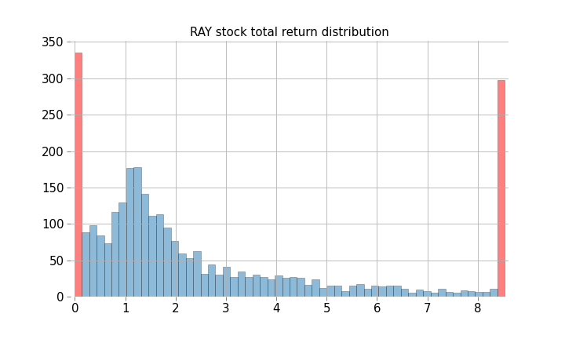

# The impact of big winners on passive and active equity investment strategies



Code for the paper ["The impact of big winners on passive and active equity investment strategies"](https://arxiv.org/abs/2210.09302).

## Project description

We investigate the impact of big winner stocks on the performance of active and passive investment strategies using a combination of numerical and analytical techniques. Our analysis is based on historical stock price data from 2006 to 2021 for a large variety of global indexes. We show that the log-normal distribution provides a reasonable fit for total returns for the majority of world stock indexes but highlight the limitations of this model. Using an analytical expression for a finite sum of log-normal random variables, we show that the typical return of a small portfolio is smaller than that of an equally weighted index. This finding indicates that active managers face a significant risk of underperforming due to the potential for missing out on the substantial returns generated by big winner stocks. Our results suggest that passive investing strategies, that do not involve the selection of individual stocks, are likely to be more effective in achieving long-term financial goals.

## Dependencies

Install all dependencies
```
pip intstall -r requirements.txt
```

## Dataset

We do not provide the actual dataset here. Mocking data will be provided in the data folder shortly.

## Modeling

- Part 1: [Empirical distribution analysis](https://github.com/maxmarkov/passive-investing/blob/master/modeling.ipynb)

- Part 2: [Finite portfolio analysis](https://github.com/maxmarkov/passive-investing/blob/master/finite_sample_ratio.ipynb)

- Part 3: [Microscopic model: Geometric Brownian Motion and its parameters](https://github.com/maxmarkov/passive-investing/blob/master/gbm_parameters.ipynb)

## References

- [Stock Pickers Are Struggling to Beat the Market](https://www.wsj.com/articles/stock-pickers-are-struggling-to-beat-the-market-11640692983)
- [Where Active Management Still Dominates ](https://www.wsj.com/amp/articles/where-active-management-still-dominates-11551669060)
- [Why indexing works?](https://arxiv.org/abs/1510.03550)
- [Broad distribution effects in sums of lognormal random variables](https://www.researchgate.net/publication/2168231_Broad_distribution_effects_in_sums_of_lognormal_random_variables)
- [The single big jump principle](https://www.johndcook.com/blog/2011/08/09/single-big-jump-principle/)
- [Attribution based on tail probabilities](https://www.johndcook.com/blog/2018/07/17/attribution/)